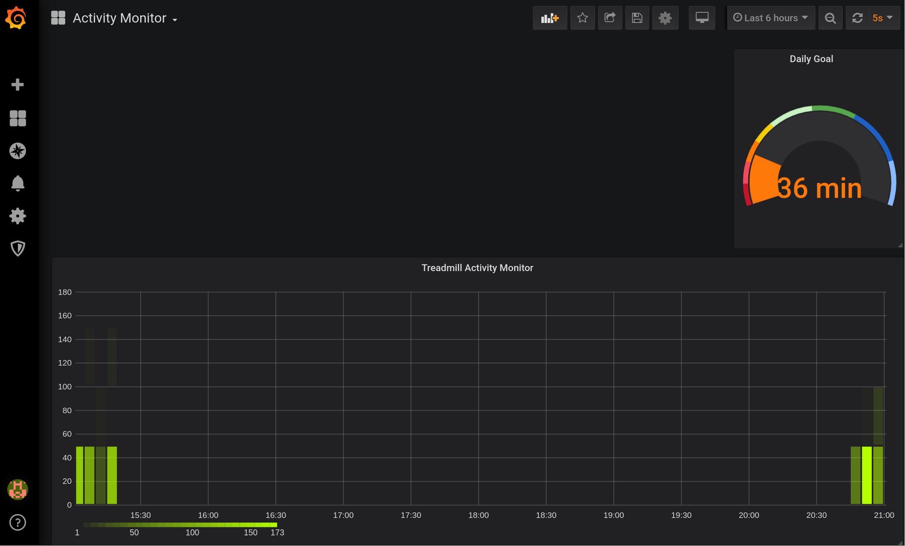

# Treadmill Activity Sensor

## Description

Track exercise goals using a Raspberry Pi and open source software. Mount HC-SR04 Ultrasonic Ranging sensor within range of exercise equipment.  Sensor tracks usage on a continuous basis and uploads usage to time-series database InfluxDB.  Create a customized Grafana Dashboard to set personalized workout goals.   

 


## Component List

- Raspberry Pi
- [HC-SR04](https://lastminuteengineers.com/arduino-sr04-ultrasonic-sensor-tutorial/) Ultrasonic Ranging Sensor
- Light-emitting diode (LED)

## Software Dependencies

- Modern c++ compiler g++ / clang++
- WiringPi Library (https://github.com/WiringPi/WiringPi)
- CMake > 3.16
- InfluxDB (Grafana for visualization)

## Wiring Schematic

TODO

## Hardware Installation

TODO

## Software Installation

Installation instructions:

```
cd /usr/src/
git clone <repo>
cd <dir>
cmake .
```

Install systemd files: [/config](/config/)

